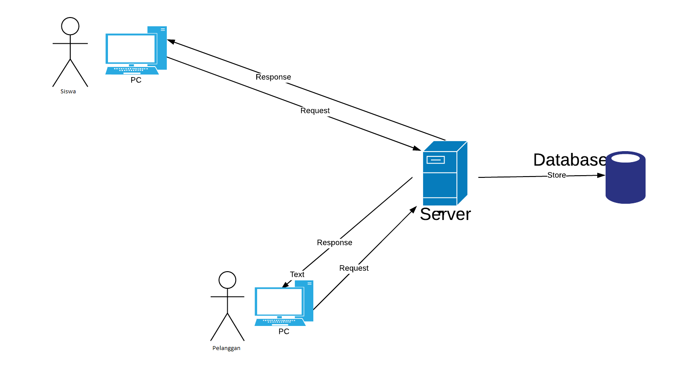

<html>
<body>

<h1> Software Requirements Spesification</h1>

1 November 2023</b>

<b>Sistem Pengelolaan Laundry  
</b>

Kelompok 5  
 Jimmy Tan (2257301065) 
 Humberto (2257301056) 
 Felix Immanuel (2257301046)   

<b>Prodi Sistem Informasi</b> 

<b>Politeknik Caltex Riau</b>

<b>2023</b>

</body>
</html>
 

**BAB I Pendahuluan**
----------
1.1 Tujuan
----------
Dokumen Software Requirement Specification (SRS) merupakan dokumen spesifikasi perangkat lunak untuk membangun "Sistem Pengelola Laundry SMK Negeri 1 Pekanbaru". Dokumen ini dibangun untuk memudahkan pihak sekolah SMK Negeri 1 Pekanbaru untuk mengelola data-data customer yang ada di Laundry sekolah. Sehingga dokumen ini dapat dijadikan acuan teknis untuk membangun sistem "Sistem Pengelola Laundry SMK Negeri 1 Pekanbaru".

1.2   Lingkup
----------
Sistem Pengelola Laundry SMK Negeri 1 Pekanbaru merupakan aplikasi yang kami bangun untuk mempermudah siswa-siswi SMK Negeri 1 dalam melakukan pengelolaan yang ada pada unit operasi sekolah yaitu unit operasi laundry sehingga memudahkan para siswa dalam melihat data-datanya dan mengelola data-data yang ada.

1.3    Akronim, singkatan, definisi
----------

| Istilah | Definisi |
| ------ | ------ |
| SRS |Software Requirement Specification|
| Login | Digunakan untuk mengakses aplikasi |
| Software Requirement Specification | Perangkat lunak yang akan dibuat dan sebagai menjembatani komunikasi pembuat dengan pengguna |
| Use Case | Situasi dimana  sistem anda digunakan untuk memenuhi satu atau lebih kebutuhan pemakaian anda |

1.4   Referensi
----------
Referensi yang digunakan dalam perangkat lunak ini adalah:
https://play.google.com/store/apps/details?id=id.matik.application.matiklaundry

1.5   Overview
----------

Bab selanjutnya yaitu menjelaskan sistem yang diterapkan pada aplikasi. Menjelaskan gambaran umum dari aplikasi, sistem interface aplikasi dan alur sistemnya. Bab terakhir menjelaskan tentang setiap fungsi yang digunakan secara teknisnya. Pada bab 2 dan 3 merupakan deskripsi dari aplikasi yang akan diterapkan pada aplikasi yang dibuat.

**BAB II Gambaran umum**
----------
Pada zaman era globalisasi perkembangan teknologi begitu sangat pesat, salah satunya ialah perkembangan teknologi di bidang software engineering dimana software engineering dapat digunakan dalam kehidupan sehari - hari .dalam studi kasus Proyek Framework ini kami menganalisis kebutuhan suatu sekolah yaitu SMK Negeri 1 Pekanbaru. Kasus yang kami peroleh adalah tidak adanya pencatatan bagi siswa yang menggunakan unit operasi laundry sekolah sebagai sarana tempat kerja sekolah. Maka dari itu kami merancang sebuah sistem sesuai dengan kebutuhan sekolah dengan menerapkan sistem pengelolaan laundry. Sehingga memudahkan para siswa dalam melakukan pengelolaan data-data dari customer. Software yang kami buat ini berbasis website dimana website sebagai admin, siswa, pelanggan. Sistem yang kami buat di dalamnya terdapat pemesanan online, angka pakaian kotor, bill pembayaran, status pesanan laundry, laporan peforma laundry, riwayat pelanggan. Berikut akan kami jelaskan sistem software kami, admin fungsi utama yaitu :
- Menghasilkan laporan harian, mingguan, atau bulanan tentang kinerja bisnis.
- Melihat data tentang jumlah pesanan, pendapatan, dan tren pelanggan.
- Mengelola status pesanan (dalam proses, siap diambil, sudah diambil, dll).
- Melihat detail pesanan, termasuk jenis cucian, instruksi, dan waktu pengambilan.

Berikut ini fungsi customer :
- Melacak status pesanan mereka (dalam proses, siap diambil, selesai).
- Menerima notifikasi dari whatsapp ketika cucian sudah siap diambil.
- Mengakses riwayat pesanan sebelumnya.
- Melihat detail pesanan sebelumnya, termasuk tagihan.
- Memberikan ulasan dan peringkat atas layanan yang diterima.

2.1   Perspektif produk
----------
Sistem pengelola laundry SMK Negeri 1 Pekanbaru adalah sebuah sistem pengelolaan sebuah laundry di Sekolah yang diaplikasikan pada website. Terdapat 2 jenis yaitu Siswa dan Pelanggan. Pengolahan data di kelola oleh siswa pada website dan pelanggan hanya melihat data dan status pencucian pada website.
Pada sistem pengelola laundry data ini akan menampilkan isi  yang sudah diinputkan oleh siswa.

**2.1.1 Antarmuka sistem**

Sistem Pengelolaan Laundry memiliki 2 user yaitu Siswa dan Pelanggan. Siswa memiliki fungsi yaitu mengelola data. Pelanggan untuk melihat status dari detail dari pemesanan.

**2.1.2 Antarmuka pengguna**

Antarmuka pengguna merupakan proses langsung  yang akan dilihat oleh pelanggan. Aplikasi Laundry ini memungkinkan pengguna untuk melakukan pemesanan laundry, melacak pesanan, dan berinteraksi dengan layanan pelanggan.

|  |  |
|--|--|
|  Pada halaman ini menampilkan halaman utama dari Sistem ini.|  Pada halaman ini menjelaskan mengenai Sistem Laundry ini.|
|  Pada halaman ini menampilkan informasi mengenai kontak yang dapat dihubungi.|  Pada halaman user, terdapat Wash Your Clothes yang menampilkan cucian dan harga cucian, kemudian washing status yang menampilkan status pencucian|
|  Disaat user memilih tombol See Details, akan menuju ke halaman ini yang berisi detail-detail pencucian secara rinci.|  Pada halaman ini, user dapat mengubah data diri.|
|  Pada halaman admin, menampilkan pencucian-pencucian dari pelanggan, disini juga admin dapat mencari nama user untuk melihat berapa banyak user telah mencuci. Admin juga dapat menambah cucian.|  Pada pop icon ini, admin mengisi username, tipe pencucian, dan berat dari cucian user.|
 
**2.1.3 Antarmuka perangkat keras**

Perangkat keras  pada Sistem pengelolaan Laundry merujuk pada perangkat fisik yang akan  menjalankan aplikasi seperti : 
1. Server: menyimpan data pelanggan, pesanan, dan informasi lainnya
2. Peralatan mobile: terhubung ke aplikasi
3. Printer dan scanner untuk menerima dan mencetak pesanan
4. Terminal kasir: menerima pembayaran dari pelanggan
5. Peralatan laundry: melakukan proses pencucian pakaian

**2.1.4 Antarmuka perangkat lunak**

Antarmuka perangkat lunak Sistem Pengelolaan Laundry digunakan untuk mengotomatiskan berbagai proses yang telah dirancang untuk menjalankan aplikasi laundry

**2.1.5 Antarmuka Komunikasi**

Antarmuka komunikasi yang digunakan untuk mengoperasikan Perangkat Lunak Sistem Pengelola Laundry SMK Negeri 1 Pekanbaru antara lain :
1. Kabel Lan
2. Wifi

**2.1.6 Batasan memori**

Tidak ada

**2.1.7 Operasi-operasi**

| Operasi | Fungsi |
| ------ | ------ |
| Login | Digunakan untuk mengakses sistem |
| Register | Digunakan untuk membuat akun untuk mengakses sistem |
| Input Data | Digunakan untuk memasukkan data-data |
| Kembali | Digunakan untuk kembali ke halaman sebelumnya |
| Edit | Digunakan untuk mengubah data |
| View | Digunakan untuk menampilkan data |
| Simpan | Digunakan untuk menyimpan data |

**2.1.8 Kebutuhan adaptasi**

Tidak ada
   
2.2 Spesifikasi Kebutuhan fungsional
----------

   
**2.2.1 Siswa Register**

Use Case : Register

Diagram : 

Deskripsi Singkat
Deskripsi Singkat : Siswa melakukan register terlebih dahulu sebelum masuk ke tampilan login. Deskripsi langkah-langkah
1. Siswa melakukan register dengan username dan password
2. Sistem melakukan validasi data register
3. Bila sukses sistem akan mengarahkan ke halaman login
4. Bila gagal sistem akan menampilkan peringatan dan redirect ke halaman register

**2.2.2 Siswa Login**

Use Case: Siswa Login

Diagram: 

Deskripsi Singkat : Siswa melakukan login terlebih dahulu sebelum masuk ke tampilan home. Deskripsi langkah-langkah
1. Siswa melakukan login dengan username dan password yang sudah ter-regis
2. Sistem melakukan validasi data login
3. Bila sukses sistem akan mengarahkan ke halaman home
4. Bila gagal sistem akan menampilkan peringatan dan redirect ke halaman login

**2.2.3 Siswa mengelola data pelanggan**

Use Case : Siswa Mengelola data pelanggan

Diagram :

Deskripsi Singkat : Siswa yang sudah login dapat memilih untuk mengelola data pelanggan. Deskripsi langkah-langkah
1. Siswa dapat menginput data dari pelanggan yang sudah melakukan pemesanan jasa laundry ke sistem dari akun yang sudah di regis oleh pelanggan.
2. Data-data pelanggan dikelola seperti nomor hp, alamat, nama lengkap
3. Siswa melakukan input data pelanggan yang melakukan pemesanan jasa laundry
      
**2.2.4 Siswa mengelola data cucian pelanggan**

Use Case : Siswa mengelola data cucian pelanggan

Diagram:

      
Deskripsi Singkat : Siswa dapat mengelola data cucian pelanggan. Deskripsi langkah-langkah
1. Siswa dapat menginput data dari cucian yang sudah dipesan oleh pelanggan ke sistem.
2. Data cucian pelanggan yang diinput berupa deskripsi pemesanan yang sudah dilakukan seperti jenis barang cucian, berat cucian, total pakaian.

**2.2.5 Siswa mengelola data pesanan**

Use Case : Siswa mengelola data pesanan

Diagram:

Deskripsi Singkat : Siswa dapat mengelola data pesanan yang ada. Deskripsi langkah-langkah
1. Siswa menginput data dari pesanan pelanggan yang sudah melakukan pemesanan jasa laundry ke sistem.
2. Data-data pesanan dikelola seperti status pemesanan, jumlah pesanan

   
**2.2.6 Pelanggan Register**

Use Case: Pelanggan Register

Diagram:

Deskripsi Singkat : Pelanggan melakukan register terlebih dahulu sebelum masuk ke tampilan login. Deskripsi langkah-langkah
1. Pelanggan melakukan register dengan username dan password
2. Sistem melakukan validasi data register
3. Bila sukses sistem akan mengarahkan ke halaman login
4. Bila gagal sistem akan menampilkan peringatan dan redirect ke halaman register

**2.2.7 Pelanggan Login**

Use Case: Pelanggan Login

Diagram:

Deskripsi Singkat : Pelanggan melakukan login terlebih dahulu sebelum masuk ke tampilan home. Deskripsi langkah-langkah
1. Pelanggan melakukan login dengan username dan password yang sudah ter-regis 
2. Sistem melakukan validasi data login
3. Bila sukses sistem akan mengarahkan ke halaman home
4. Bila gagal sistem akan menampilkan peringatan dan redirect ke halaman login

**2.2.8 Cek Status Cucian**

Use Case: Cek Status Cucian

Diagram:

Deskripsi Singkat : Pelanggan dapat melihat status cucian yang sedang dalam pesanan
1. Pelanggan yang sudah melakukan pemesanan dapat melihat status cucian pesanan
2. Status cucian berupa deskripsi seperti sudah selesai, belum selesai

**2.2.9 Melihat detail cucian**

Use Case: Melihat detail cucian

Diagram:

Deskripsi Singkat : Pelanggan dapat melihat detail dari pesanan yang sedang dicuci
1. Pelanggan yang sudah melakukan pemesanan dapat melihat detail cucian pesanan
2. Status cucian berupa deskripsi seperti tanggal pemesanan, total berat pakaian, banyak pakaian

2.3   Spesifikasi Kebutuhan non-fungsional
----------
- Tabel Kebutuhan Non-Fungsional 

   | No | Deskripsi |
   | ------ | ------ |
   | 1 | Semua interface dan fungsi menggunakan Bahasa Indonesia |
   | 2 | Perangkat Lunak dapat dipakai di semua platform  OS ( Siswa, dan pelanggan ) 
 
2.4   Karakteristik pengguna
----------
Karakteristik pengguna dari perangkat lunak ini adalah pengguna langsung berinteraksi dengan sistem tanpa harus dihubungkan dengan hak akses atau level autentikasi.

2.5   Batasan-batasan
----------
- Perangkat lunak web hanya dijalankan di windows (7,8,10). 
- Waktu pengembangan perangkat lunak yang singkat membuat adanya kemungkinan tidak semua fungsi yang ada dapat dilaksanakan.

2.6   Asumsi-asumsi
----------
Maksimal penginputan id atau memasukkan kode pada aplikasi ini adalah 9999, lebih dari itu program akan muncul peringatan"Anda telah melebihi batas maksimum".

2.7   Kebutuhan Penyeimbang
----------
Tidak ada

BAB III Requirement specification
----------
3.1 Persyaratan Antarmuka Eksternal
----------
Salah satu cara mengakses aplikasi ini yaitu dengan hak akses yang didapatkan melalui register sistem, login melalui aplikasi ini dengan mencantumkan username  dan password kemudian sistem akan mencocokkan username dan password yang ada pada database. Setelah login berhasil Siswa dapat melihat data-data dari pelanggan, cucian pelanggan, dan pesanan.
      
3.2 Functional Requirement
----------
Logika Struktur terdapat pada bagian 3.3.1
      
**3.2.1 Siswa Register**

|  |  |
|--|--|
| Nama Fungsi | Register |
| Xref | Bagian 2.2.1, Register Siswa |
| Trigger | Membuka sistem pengelolaan laundry SMK Negeri 1 Pekanbaru |
| Precondition | Halaman Register |
| Basic Path | 1. Siswa mengisi form register dengan username dan password   2.Siswa mengklik tombol regis   3. Sistem melakukan validasi regis   4. Bila sukses sistem akan mengarahkan ke halaman login   5. Bila gagal sistem akan menampilkan peringatan |
| Alternative | Tidak ada |
| Post Condition | Siswa dapat melakukan login ke SIstem Pengelolaan Laundry SMKN 1 Pekanbaru |
| Exception Push | Username dan password salah |
      
**3.2.2 Siswa Login**

|  |  |
|--|--|
| Nama Fungsi | Login |
| Xref | Bagian 2.2.2, Login Siswa |
| Trigger | Membuka sistem pengelolaan laundry SMK Negeri 1 Pekanbaru |
| Precondition | Sudah melakukan register |
| Basic Path | 1. Siswa mengisi form login dengan username dan password yang sudah diregis   2. Siswa mengklik tombol login  3. Sistem melakukan validasi regis   4. Bila sukses sistem akan mengarahkan ke halaman utama.   5. Bila gagal sistem akan menampilkan peringatan |
| Alternative | Tidak ada |
| Post Condition | Siswa dapat masuk ke SIstem Pengelolaan Laundry SMKN 1 Pekanbaru dengan akun yang sudah ada |
| Exception Push | Username dan password salah |
   
**3.2.3 Siswa Mengelola data pelanggan**

|  |  |
|--|--|
| Nama Fungsi | Mengelola data pelanggan |
| Xref | Bagian 2.2.3, Siswa Mengelola data pelanggan |
| Trigger | Membuka bagian pengelolaan data pelanggan pada sistem |
| Precondition | Sudah melakukan berada pada halaman utama admin |
| Basic Path | 1. Siswa sudah masuk kedalam sistem dalam keadaan login   2. Siswa membuka bagian data pelanggan   3. Siswa dapat mengelola data dari pelanggan yang akan melakukan pemesanan |
| Alternative | Tidak ada |
| Post Condition | Data pelanggan akan tersimpan dalam sistem |
| Exception Push | Input data pelanggan diluar dari yang disediakan |
   
**3.2.4 Siswa Mengelola data cucian pelanggan**

|  |  |
|--|--|
| Nama Fungsi | Mengelola data cucian pelanggan |
| Xref | Bagian 2.2.4, Siswa Mengelola data cucian pelanggan |
| Trigger | Membuka bagian pengelolaan data cucian pelanggan pada sistem |
| Precondition | Sudah ada yang melakukan pemesanan dan data pelanggan sudah ada |
| Basic Path | 1. Siswa sudah masuk kedalam sistem dalam keadaan login   2. Siswa membuka bagian data cucian pelanggan   3. Siswa dapat mengelola data cucian dari pelanggan yang sudah melakukan pemesanan |
| Alternative | Tidak ada |
| Post Condition | Data cucian pelanggan dapat dikelola oleh Siswa |
| Exception Push | Input data cucian pelanggan diluar dari yang disediakan |
   
**3.2.5 Siswa Mengelola data pesanan**

|  |  |
|--|--|
| Nama Fungsi | Mengelola data cucian |
| Xref | Bagian 2.2.5, View data kependudukan |
| Trigger | Membuka aplikasi Manajemen Administrasi Data Kependudukan Desa Lohbener |
| Precondition | Halaman form input data |
| Basic Path | 1. Sistem akan menampilkan data kependudukan desa Lohbener.   2. Admin melihat data dan dapat mengedit atau menghapusnya.   3. Sistem menampilkan edit data kependudukan  4. Admin  mengedit data kependudukan yang baru atau yang sudah ada 5. Sistem melakukan validasi jika data sudah ada maka muncul peringatan jika belum sistem akan menyimpan|
| Alternative | Tidak ada |
| Post Condition | Halaman data kependudukan |
| Exception Push | Tidak ada koneksi |
   
**3.2.6 Cetak Laporan**

|  |  |
|--|--|
| Nama Fungsi | Laporan |
| Xref | Bagian 2.2.6, Cetak Laporan |
| Trigger | Membuka aplikasi Manajemen Administrasi Data Kependudukan Desa Lohbener |
| Precondition | halaman utama admin |
| Basic Path | 1. Admin mengklik tombol laporan   2. Sistem menampilkan laporan kependudukan   3. Admin memilih combobox tersebut dan klik tombol lihat  4. Sistem akan menampilkan hasil laporan.  5. Admin mencetak laporan  |
| Alternative | Tidak ada |
| Post Condition | Halaman Laporan |
| Exception Push | Tidak ada koneksi, data belum diinput |

**3.2.7  Admin mengelola user**

|  |  |
|--|--|
| Nama Fungsi | Mengelola user |
| Xref | Bagian 2.2.7, Mengelola user |
| Trigger | Membuka aplikasi Manajemen Administrasi Data Kependudukan Desa Lohbener | 
| Precondition | halaman utama admin |
| Basic Path | 1. Sistem menampilkan form. 2. Admin mengisi form user dengan jabatan, tanggal mulai, tanggal berakhir, dll kemudian klik tombol simpan. 3. Sistem akan menyimpan data user ke database.  |
| Post Condition | Halaman user |
| Exception Push | Tidak ada koneksi, data belum diinput |
   
3.3 Struktur Detail Kebutuhan Non-Fungsional
----------
**3.3.1 Logika Struktur Data**
Struktur data logika pada sistem Aplikasi presensi menggunakan kehadiran terdapat struktur Database yang dijelaskan menggunakan ERD.

**Tabel User**

| Data Item | Type | Deskripsi |
| ------ | ------ | ------ |
| Id_user| int | Nomer auto increment Id_user|
| Username | varchar | berisikan Nik untuk akses login user dan username untuk akses admin |
| Password | varchar | berisikan password untuk login admin dan user |
| level | varchar | untuk membedakan level saat login antara admin dan user

**Tabel Warga**

| Data Item | Type | Deskripsi |
| ------ | ------ | ------ |
| NIK | varchar | nomer kependudukan|
| Nama | varchar | nomer kependudukan|
| jns_kelamin | varchar | Identifikasi jenis kelamin|
| Tgl_lahir | date | tanggal lahir peserta |
| Agama | varchar | Identifikasi agama |

**Tabel Pegawai**

| Data Item | Type | Deskripsi |
| ------ | ------ | ------ |
| Id_pegawai| int | Nomer auto increment Id_bioadmin|
| Id_user| int | untuk mengambil username dan password admin pada tabel user|
| nik| varchar | nik admin|
| jabatan | varchar | mendefinisikan level user |
| tgl_masuk | date | awal jabatan|
| tgl_keluar | date | akhir jabatan|

**Tabel Kelahiran**

| Data Item | Type | Deskripsi |
| ------ | ------ | ------ |
| Id_kelahiran| int | Nomer auto increment Id_kelahiran|
| Id_warga| int | foreignt key tabel warga |
| tgl_lahir| date | tanggal lahir anak |
| jns_kelamin| varchar | jenis kelamin anak|
| ayah | varchar | nama ayah|
| ibu | varchar | nama ibu|
| tmp_lahir| varchar | tempat lahir anak |
| rt | int | nomor rt|
| rw | int | nomor rw|

**Tabel Kematian**

| Data Item | Type | Deskripsi |
| ------ | ------ | ------ |
| Id_kematian| int | Nomer auto increment Id_kematian|
| Id_warga| int | foreignt key tabel warga |
| tmp_kematian| varchar | tempat lahir anak |
| tgl_kematian| date | tanggal lahir anak |
| rt | int | nomor rt|
| rw | int | nomor rw|

**Tabel Pekerjaan**

| Data Item | Type | Deskripsi |
| ------ | ------ | ------ |
| Id_pekerjaan| int | Nomer auto increment Id_pekerjaan|
| Id_warga| int | foreignt key tabel warga |
| pekerjaan| varchar | pekerjaan masyarakat  |
| tgl_input | date | tanggal input pekerjaan |

**Tabel Pendidikan**

| Data Item | Type | Deskripsi |
| ------ | ------ | ------ |
| Id_pendidikan| int | Nomer auto increment Id_pendidikan|
| Id_warga| int | foreignt key tabel warga |
| pendidikan| varchar | pendidikan masyarakat  |
| tgl_masuk | date | tanggal masuk pendidikan |

**Tabel ktp**

| Data Item | Type | Deskripsi |
| ------ | ------ | ------ |
| Id_ktp| varchar | Nomer auto increment Id_angdes|
| Id_warga| int | foreignt key tabel warga |
| status_ktp| varchar | Identifikasi memiliki atau belum memiliki ktp |
| masa_berlaku | date | tanggal berlaku ktp |

**Tabel kk**

| Data Item | Type | Deskripsi |
| ------ | ------ | ------ |
| Id_kk| varchar | Nomer auto increment Id_angdes|
| Id_warga| int | foreignt key tabel warga |
| kepala_keluarga| varchar | nama kepala keluarga |
| no_kk | varchar | nomor kk |

**Tabel pindah**

| Data Item | Type | Deskripsi |
| ------ | ------ | ------ |
| Id_pindah| varchar | Nomer auto increment Id_angdes|
| Id_warga| int | foreignt key tabel warga |
| tgl_pindah | date | tanggal akan pindah |
| ket | varchar | alamat pindah |

**Tabel datang**

| Data Item | Type | Deskripsi |
| ------ | ------ | ------ |
| Id_datang| varchar | Nomer auto increment Id_angdes|
| Id_warga| int | foreignt key tabel warga |
| tgl_datang | date | tanggal kedatangan |
| ket | varchar | alamat sebelum datang |

**Tabel pilih**

| Data Item | Type | Deskripsi |
| ------ | ------ | ------ |
| Id_pilih| varchar | Nomer auto increment Id_angdes|
| Id_warga| int | foreignt key tabel warga |
| status_pilih | varchar | hak pilih |

**Tabel kawin**

| Data Item | Type | Deskripsi |
| ------ | ------ | ------ |
| Id_kawin| varchar | Nomer auto increment Id_angdes|
| Id_warga| int | foreignt key tabel warga |
| status_kawin | varchar | status warga |

**Tabel Laporan**

| Data Item | Type | Deskripsi |
| ------ | ------ | ------ |
| Id_laporan| int | Nomer auto increment Id_laporan|
| Id_warga| int | foreignt key tabel warga |
| laporan | varchar | berisi laporan kependudukan |

**Tabel Agama**

| Data Item | Type | Deskripsi |
| ------ | ------ | ------ |
| Id_agama| int | Nomer auto increment Id_laporan|
| Id_warga| int | foreignt key tabel warga |
| agama| varchar | berisi agama penduduk |
